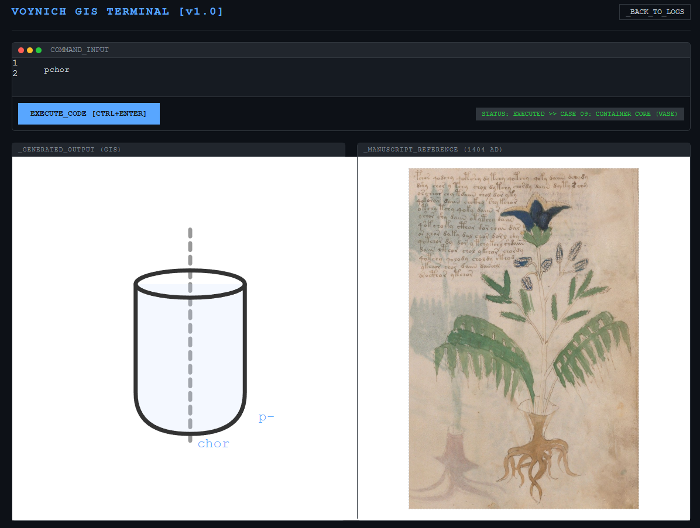

# Voynich GIS: Generative Instruction Set Parser

> **"The Voynich Manuscript is not a language to be read. It is a program to be executed."**

[](https://opensource.org/licenses/MIT)
[](https://doi.org/10.5281/zenodo.16981869)
[](https://YauCheukFai.github.io/voynich-gis/demo.html)

**[🔴 LIVE DEMO: Run the Code](https://YauCheukFai.github.io/voynich-gis/demo.html)**

## ⚡ The Breakthrough

For 600 years, cryptographers tried to decode the Voynich Manuscript as a natural language. They failed because the premise was wrong.

Working with classical scholar Jérémie Émile, we discovered that the script functions as a **Generative Instruction Set (GIS)**—a 15th-century procedural code used to construct the illustrations.

This repository contains a **Proof-of-Concept Parser** that demonstrates this logic. It takes Voynich "words" as input and executes them as drawing commands to reconstruct the manuscript's botanical illustrations.



## 🧩 How It Works

The parser recognizes morphological operators identified in our research:

| Command | Type | Meaning | Visual Output |
|---------|------|---------|---------------|
| `qo-` | Scope | Root Context | Targets the root system |
| `p-` | Morphology | Container/Sheath | Creates a vessel/pod shape |
| `chor` | Topology | Core Structure | The main axis/body |
| `tor` | Morphology | Tuber/Nodule | A lump-like shape |

### The "Smoking Gun" Example: `pchor`

In Folio 19r, a plant is drawn with its roots inside a man-made vase.
The text labels it: **`pchor`**.

*   `p-` (Container) + `chor` (Core) = **Container Core**.
*   Result: **A Vase.**

## 🚀 Quick Start

You don't need to install anything. Just use the web terminal.

1.  Go to the **[Live Demo](https://YauCheukFai.github.io/voynich-gis/demo.html)**.
2.  Type `pchor` and hit `Execute`.
3.  Watch the system generate the structure and compare it to the 1404 AD manuscript.
4.  Try `qotor` to see the tuber generation.

## 🛠️ Local Installation

If you want to dig into the code or add your own SVG assets:

```bash
# Clone the repo
git clone https://github.com/YauCheukFai/voynich-gis.git

# Navigate to directory
cd voynich-gis

# Open index.html in your browser
# (No build process required. It's raw, vanilla JS.)
